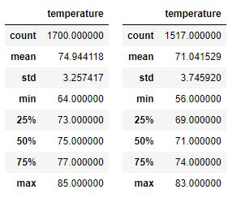
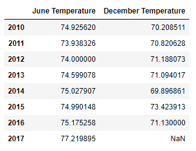
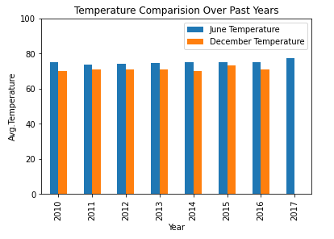

# surfs_up
using jupyter notebook to retireve the data stored in a SQLlite database, A Weather analysis for the business venture "Waves and Ice Cream" is created for the stake holders and help secure the sponsor/ invvestment.

## Overview of Project
## Purpose
- In this project, a statistical analysis of temperature and precipitation observations recorded for the past years.  
- This will help the investors feel confident with their investement that setting up a business is ideal for the Oahu in Hawaii. 
- The Data is analyzed from a file in AQLite format. Using python and SQLalchemy,
- Temeperature and Precipitation data is queried for the month of june and decemeber.

## Resources 
- VS Code v1.50.0 
- Jupyter Notebook v6.1.1
- SQLite Data - hawaii.sqlite

## Results
#### Outcome from the analysis:
- The average temperature in June is 74.94 which is slightly higher than the average temperature observation in december at 71.04 respectively.
- The minimum temperature ever recorded is 64.00 and Decemeber minimum temperature recorded was 55.00 respectively

## Summary
- The overall results of temperature observations recorded and analyzed over the months of June and December shows promising trend of favorable temperatures to setup shop "Waves and Ice Cream."
- Although there is a slight drop in temperatures for the month of december, the climate is not classified as a harsh winter but infact is constantly averaging in the low 70's. 
- The below table shows yearly average temperature since 2010 upto 2017 of temperatures recorded in the months of June and December. 

- Further more the chart below shows consistency. solidifying a decision to set up shop! 

## Recommendations
- An analysis for other locations at Hawaii could be done to see a more favorable option in terms of temperature and precipitation. 
- Also other aspects like wave heights which is data that can be studied for serious surfers.
